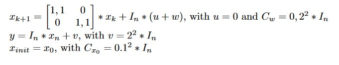

# Estimators

## Hidden Markov Model
Predicting and estimating states in hidden markov moddel.

### Function
Predicting/ Estimating states.

### Usage
#### Prediction
```python
prediction(A, inital, k)
```

  ****Parameters:**** <br />
  
* A:        transitionmatrix
* inital:   Initial state
* k:        after how many timesteps predicted meassurement

****Retruns:**** <br />
* probability for predicted states

#### Wonham Filter
```python
wonham(pred, B, m)
```


  ****Parameters:**** <br />
  
* pred - predicted state
* B - meassurement matrix
* m - realized prediction

****Retruns:**** <br />
* probability for estimated states
                  
### Example
This hidden markov moddel has 10 states, 5 visable outputs and after 10 steps the output is meassured. The values of the transition matrix are randomly generated. A meassurement leads to 5 equally distributed states.

**Prediction** 

Here is the prediction shown, if the first state is known to be state 0. 


**Estimation**

After that there is a meassurement of the output-state 0 after 10 steps. The new estimated state is shown in the following figure.


## Kalman Filter
Estimating states with the Kalman Filter.

### Function
Calculating Kalman Filter.

### Usage 
```python
def kalman(Cp, Cy, H)
```

  ****Parameters:**** <br />
  
* Cp - Covariance Matrix of predicted state
* Cy - Covariance Matrix of messuremant noise
* H -  Meassurement Matrix

****Retruns:**** <br />
* Kalman Filter Matrix


### Example 
The System is described by the following equations:

